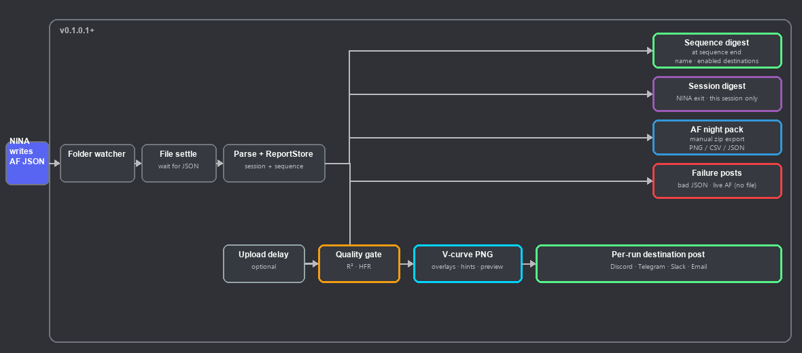
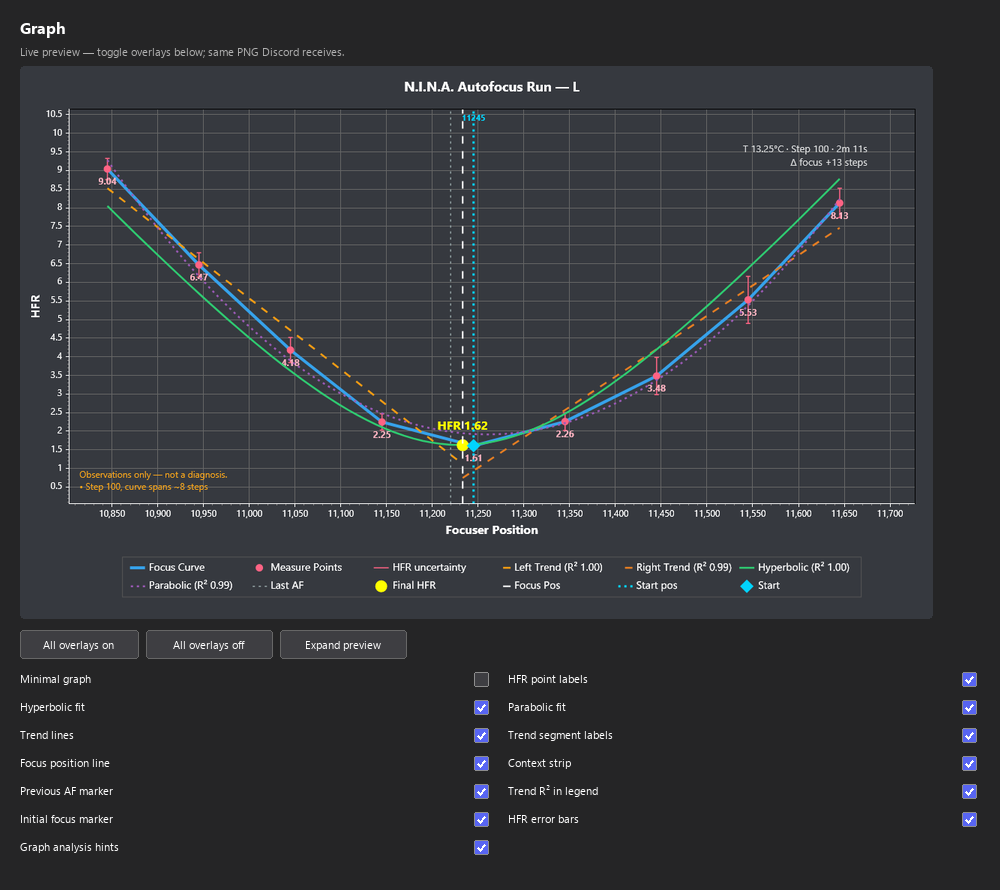

#  AutoFocusGraphs

A N.I.N.A. plugin that watches the AutoFocus report folder, renders a **dark-mode V-curve graph**, and posts per-run reports and digests to **Discord**, **Telegram**, **Slack**, **email**, or any combination.

> **Status:** v0.1.0.0 on `develop` — multi-destination autofocus graph delivery for N.I.N.A. 3.3 nightlies.

## How it works



Color key: **blue** = NINA trigger · **green** = sequence digest / destination post · **purple** = session digest · **red** = failure posts · **amber** = quality gate · **cyan** = V-curve graph.

1. **NINA writes AF JSON** — Hocus Focus / built-in autofocus saves a report under `%localappdata%\NINA\AutoFocus`.
2. **Folder watcher** — detects new `*.json` files in that folder.
3. **File settle** — waits until the file is fully written and readable.
4. **Parse + ReportStore** — parses the report and tracks it for the session and current sequencer run.
5. From there:
   - **Per-run destination post** (optional) — upload delay → quality gate → **V-curve PNG** → every enabled destination (Discord embed/graph, Telegram photo, Slack file upload, email attachment).
   - **Sequence digest** — when a sequencer run finishes; includes sequence name; or via **Post sequence digest now** / **Post AF sequence digest**.
   - **Session digest** — runs since NINA opened only (**Post session digest when NINA exits**), or via **Post sequence digest now** when no sequence runs are tracked. Includes sequencer run count and names when applicable.
   - **Failure posts** — optional alert when a report is empty or unreadable, or when autofocus ends without a JSON file (live AF hook).

Per-run posting, graphs, and JSON attachments can be turned off individually; **digest-only mode** collects runs locally and posts only a digest when a sequence completes and/or when NINA exits.

Graph overlays, hints, digests, and session tracking are **destination-agnostic**. Each channel implements `IAutofocusDestination`. Per-run posts fan out to every enabled destination independently — one channel failing does not block the others.

## What it does

When N.I.N.A. writes a new `*.json` autofocus report under `%localappdata%\NINA\AutoFocus`, the plugin:

1. Waits for the JSON file to finish writing, then parses and tracks the run immediately (before any upload delay)
2. Evaluates optional quality gates (R² / final HFR), including per-filter profiles
3. Optionally renders a V-curve graph and posts to every enabled destination after the upload delay

Reports are always stored for digests even when per-run posting is disabled.

### Notifications

Quality outcomes are shared across destinations:

- **Success** — clean V-curve within quality thresholds
- **Warning** — R² is low or HFR is high (quality gate)
- **Failure** — report is empty, unreadable, incomplete, or autofocus ends in NINA without a JSON report (optional live hook)

**Sequence digest** — stats + run list for the current sequencer run; shows **Sequence:** name from the saved NINA sequence file.

**Session digest** — stats + run list for **this NINA session only** (not historical disk files); **Sequences:** count and names when sequencer runs completed.

Each digest line uses a **short AF timestamp** (not the long JSON filename):

```text
• #3 **2026-07-04--14-34-19** · **Ha** | HFR 2.85 | Pos 11240 | T 13.25 · 2026-07-04 14:34:19
```

Digests include stats (min/avg/max HFR, best/worst, warnings, by-filter breakdown) and an optional HFR trend chart. Long sessions may truncate the text list. Automatic digests are skipped when no new AF JSON was written since NINA opened.

**Digest-only mode:** turn off **Post each autofocus run**, enable **Post digest when sequencer sequence completes** and/or **Post session digest when NINA exits** — runs are collected locally and only the digest(s) are posted.

Message template tokens (per-run posts): `{shortfilename}`, `{filename}`, `{filenamefull}`, `{time}`, `{filter}`, `{prefix}`. On Discord, the full filename always appears in the embed footer.

Per-run history in NINA is left to NINA's own HFR history; this plugin focuses on outbound notifications.

### Discord

When the **Discord** tab is enabled:

- **Success** — blue embed titled `AutoFocus Details — Filter {filter}`
- **Warning** — yellow embed when R² is low or HFR is high
- **Failure** — red embed for bad reports or live AF failures
- Optional role pings (`<@&roleId>`) on warnings and failures

Posts use the **name and icon configured on your Discord webhook** (Integrations → Webhooks). No bot token required.

### Telegram

When the **Telegram** tab is enabled:

- Bot token from [@BotFather](https://t.me/BotFather) + numeric chat ID (or `@channelusername`)
- Per-run graph as a photo; JSON as a document when **Attach JSON** is on
- Captions use the shared message template (Markdown-style `**bold**` converted for Telegram)

### Slack

When the **Slack** tab is enabled:

- Bot User OAuth Token (`xoxb-...`) + channel ID (`C...` or `G...`)
- Bot scopes: `chat:write` and `files:write`
- Invite the bot to the channel before testing (**Test Slack** sends text only; real AF runs upload the graph via Slack's external file API)

### Email

When the **Email** tab is enabled:

- SMTP host/port, optional username/password, from/to addresses (send-only)
- Graph PNG and optional JSON attachment on per-run posts
- **Email subject** — leave blank for defaults:
  - In sequence: `NINA AutoFocus Graphs - {sequence} - {date}`
  - Manual AF: `NINA Manual AutoFocus Graphs - {date}`
  - Custom templates supported — tokens: `{sequence}`, `{date}`, `{time}`, `{filter}`, `{shortfilename}`, `{filename}`, `{reason}`

### V-curve graph overlays

Open **Options → Plugins → AutoFocusGraphs → Graph**. A **live preview** (960×540, HiDPI-aware) at the top uses the same renderer as outbound posts and updates as you toggle options. **Expand preview** opens a larger pop-out window. **All overlays on** / **All overlays off** apply every overlay at once (off = minimal graph mode).



| Overlay | What it shows |
| --- | --- |
| **Minimal graph** | Points and final HFR only — hides fits, trends, markers, and other overlays |
| **HFR point labels** | Measured HFR value next to each point on the V-curve |
| **Hyperbolic fit** | NINA's hyperbolic focus curve; R² in the legend when enabled |
| **Parabolic fit** | Parabolic (quadratic) least-squares curve through measure points |
| **Trend lines** | Left and right linear trend segments, split at the calculated focus position |
| **Trend segment labels** | Left/right trend labels drawn on the graph |
| **Focus position line** | Vertical dashed line at the calculated focus position |
| **Context strip** | Top-right overlay: temperature, step size, run duration, and Δ focus vs previous AF |
| **Previous AF marker** | Gray dotted vertical line at the previous autofocus position |
| **Trend R² in legend** | R² values for left and right trends in the graph legend |
| **Initial focus marker** | Cyan diamond and dotted **Start pos** vertical line at the starting focuser position (always drawn, even when close to calculated focus; position label at top when offset) |
| **HFR error bars** | Vertical bars from each point's HFR uncertainty (JSON `Error` field); off by default |
| **Graph analysis hints** | Optional rule-based observations on the V-curve (lower-left); conservative mode (default) shows facts/patterns only |

**Graph options** (separate from overlays):

| Option | What it does |
| --- | --- |
| **Include filter name in graph title** | Appends filter to the title (e.g. `N.I.N.A. Autofocus Run — Ha`) |
| **Warn when fit minimum ≠ calculated focus** | Corner annotation when hyperbolic fit minimum and calculated focus differ by more than one step (`Fit Δ N steps`) |

## Requirements

- N.I.N.A. **3.3** or newer (nightly builds on .NET 10)
- At least one enabled destination:
  - **Discord:** channel webhook URL (Channel settings → Integrations → Webhooks)
  - **Telegram:** bot token + chat ID
  - **Slack:** bot token (`xoxb-...`) + channel ID; bot invited to the channel
  - **Email:** SMTP server and recipient address

## Install

**From source:**

```powershell
git clone https://github.com/chrisflory/AutoFocusGraphs.git
cd AutoFocusGraphs
git checkout develop
dotnet build -c Release
```

A successful build copies the plugin into `%localappdata%\NINA\Plugins\3.0.0\AutoFocusGraphs\`. Close N.I.N.A. before rebuilding, then restart it.

Requires the [.NET 10 SDK](https://dotnet.microsoft.com/download/dotnet/10.0).

Regenerate the pipeline diagram after flow changes:

```powershell
python tools/render_flowchart.py
```

Regenerate the README graph-options sample image after graph or options layout changes:

```powershell
python tools/render_readme_graph_section.py
```

## Configure

Open **Options → Plugins → AutoFocusGraphs** (tabbed UI):

### Graph tab

| Setting | Purpose |
| --- | --- |
| **Enable autofocus graph posts** | Turns monitoring on or off |
| **Graph** | Live preview, overlay toggles (see table above), all on/off buttons |
| **Quality gate** | Global R² / HFR limits, plus optional per-filter profile rows |
| **Play sound on quality warning** | System exclamation when a run fails the gate |
| **Post when autofocus ends without a JSON report** | Live hook for cancelled or failed autofocus runs |
| **Post failures / unreadable reports** | Alert when a report file exists but cannot be parsed |
| **What to post** | Per-run posts on/off, V-curve graph, raw JSON attachment |
| **Graph analysis hints / Conservative hints** | Optional V-curve observations; conservative (default) = facts and patterns only |
| **Session digest** | Stats + run list + optional trend chart; **this NINA session only** |
| **Post digest when sequencer sequence completes** | Sequence digest after the last per-run post (default on) |
| **Post session digest when NINA exits** | Full-session digest on shutdown |
| **Post sequence digest now** | Manual digest: current sequence first, then full session if the sequence is empty |
| **Upload delay / message template** | Timing and template tokens |
| **Watch folder** | Read-only AutoFocus path |

### Discord tab

| Setting | Purpose |
| --- | --- |
| **Enable Discord** | Include Discord in per-run and digest posts |
| **Discord webhook URL** | Channel webhook (`https://discord.com/api/webhooks/...`) |
| **Test webhook** | Sends a short test message (green ✓ / red ✗) |
| **Thread ID / nightly forum thread** | Post into a thread, or `AF yyyy-MM-dd` on forum channels |
| **Embed detail / Attachments** | Detailed or compact embeds; graph+embed, graph-only, or embed-only |
| **Discord alert role ID** | Optional numeric role ID to ping on warnings or failures |
| **Ping role on warning / failure** | Adds `<@&roleId>` to webhook content for mobile alerts |

### Telegram tab

| Setting | Purpose |
| --- | --- |
| **Enable Telegram** | Include Telegram in per-run and digest posts |
| **Telegram bot token** | From @BotFather |
| **Telegram chat ID** | Numeric chat ID or `@channelusername` |
| **Test Telegram** | Sends a short test message |

### Slack tab

| Setting | Purpose |
| --- | --- |
| **Enable Slack** | Include Slack in per-run and digest posts |
| **Slack bot token** | Bot User OAuth Token (`xoxb-...`) |
| **Slack channel ID** | Channel ID (`C...` or `G...`); bot must be invited |
| **Test Slack** | Sends a short test message |

### Email tab

| Setting | Purpose |
| --- | --- |
| **Enable email** | Include email in per-run and digest posts |
| **SMTP host / port / SSL** | Outgoing mail server (e.g. Gmail, Proton Bridge on `127.0.0.1:1025`) |
| **SMTP username / password** | Credentials; stored locally only |
| **From / To addresses** | Sender and one or more recipients (comma-separated) |
| **Email subject** | Blank = built-in defaults; custom template optional |
| **Test email** | Sends a short test message |

### Advanced Sequencer

**Post AF sequence digest** (category **AutoFocusGraphs**) — posts a sequence digest mid-run to all enabled destinations.

The options page also shows **last post** status (time + outcome) and a **digest-only mode** hint when per-run posts are off but a digest is enabled.

## Security

- Webhook URLs, bot tokens, SMTP passwords, and chat IDs are stored only in local N.I.N.A. user settings.
- Outbound posts go only to user-configured Discord webhooks, Telegram chats, Slack channels, and SMTP recipients.
- Only files under the AutoFocus folder are processed, with size and point-count limits.
- Treat webhook URLs and bot tokens like passwords; regenerate them if they are ever exposed.

## License

MIT — see [LICENSE](LICENSE).
