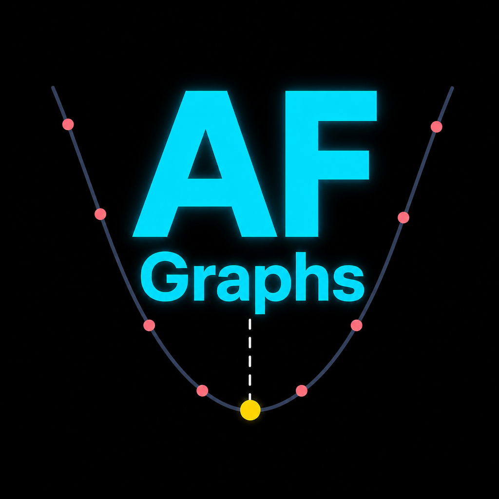

#  AutofocusGraphs

**Experimental spin-off of [AutofocusDiscord](https://github.com/chrisflory/AutofocusDiscord)** — same V-curve graph engine, multiple delivery channels.

N.I.N.A. plugin that watches autofocus JSON reports, renders dark-mode V-curve PNGs (ScottPlot), and posts them to **Discord**, **Telegram**, or both. More destinations can plug in behind the same graph pipeline.

> **Status:** `develop` branch — not a replacement for AutofocusDiscord yet. Install side-by-side only if you want to test (different plugin GUID / folder name).

## Architecture

```
NINA AF JSON → parse + quality gate → AutofocusGraphGenerator (shared PNG)
                                      ↘ IAutofocusDestination router
                                         ├─ Discord (webhook + embeds)
                                         └─ Telegram (Bot API sendPhoto)
```

Graph overlays, hints, digests, and session tracking are **destination-agnostic**. Each channel implements `IAutofocusDestination`.

## Requirements

- N.I.N.A. **3.3** or newer (.NET 10 nightlies)
- **Discord:** channel webhook URL
- **Telegram:** bot token from [@BotFather](https://t.me/BotFather) + chat ID
- **Slack:** bot token (`xoxb-...`) + channel ID (`C...` / `G...`); bot needs `chat:write` and `files:write`

## Install (from source)

```powershell
git clone https://github.com/chrisflory/AutofocusGraphs.git
cd AutofocusGraphs
git checkout develop
dotnet build -c Release
```

Deploys to:

`%localappdata%\NINA\Plugins\3.0.0\AutofocusGraphs\`

Close N.I.N.A. before rebuilding.

## Configure

**Options → Plugins → AutofocusGraphs** (tabbed like NINA Ground Station)

| Tab | Contents |
|---|---|
| **General** | Master enable + status |
| **Discord** | Webhook, threads, embed/attach, role pings |
| **Graph** | Live preview + overlays |
| **Telegram** | Bot token, chat ID, test |
| **Slack** | Bot token, channel ID, test |
| **Quality & posting** | Quality gate, digests, per-run toggles |

1. **Enable autofocus graph posts** — master monitoring switch
2. Enable one or more destinations on their tabs and run each **Test** button
3. **Graph** tab — overlays and preview (shared PNG for all destinations)

Enable any combination of destinations. Per-run posts and digests fan out to every enabled, configured channel.

## Relationship to AutofocusDiscord

| | AutofocusDiscord | AutofocusGraphs |
| --- | --- | --- |
| Focus | Discord webhook only | Multi-channel graph delivery |
| Plugin ID | `a7c3e91f-…` | `b8d4f02a-…` (separate install) |
| Maturity | Released (v1.3.1.x) | Experimental (v0.1.0.0) |

AutofocusDiscord remains the stable Discord-only plugin until AutofocusGraphs is proven out.

## License

MIT — Chris Flory @starjunkie
